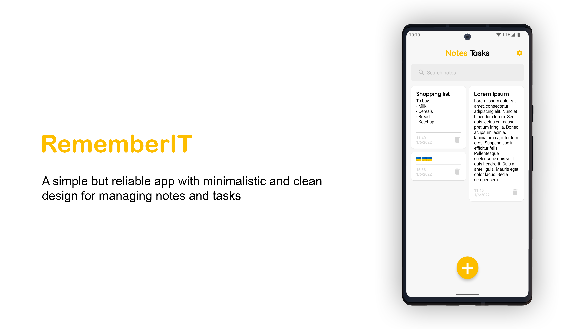
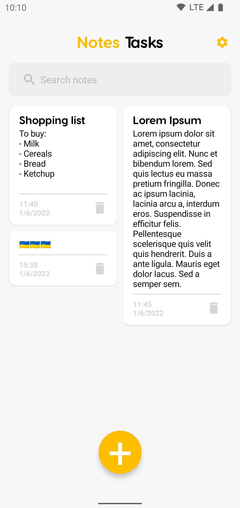
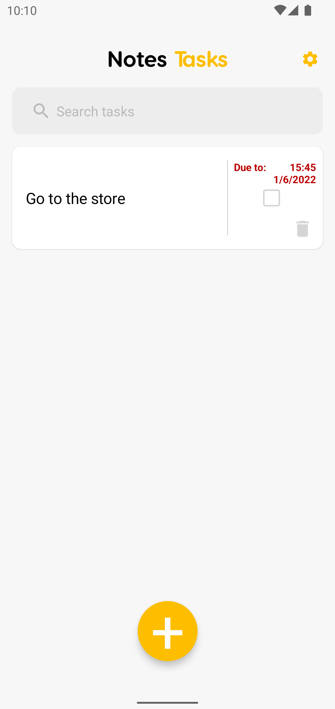
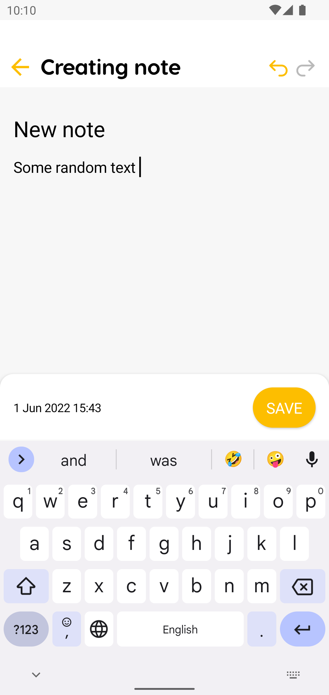
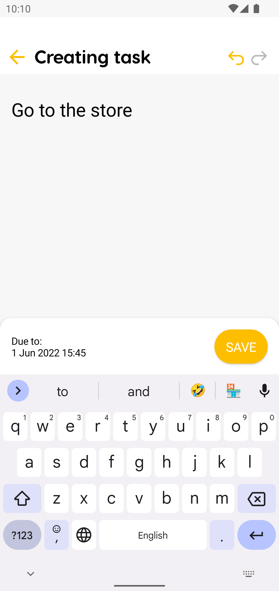
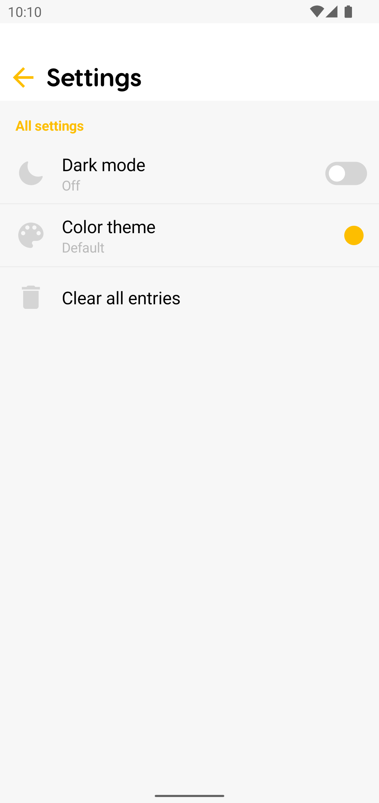
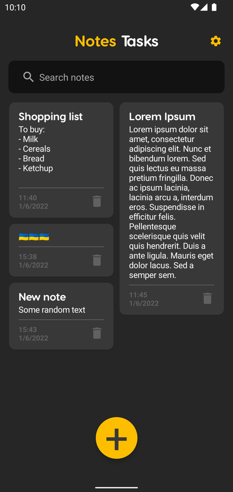
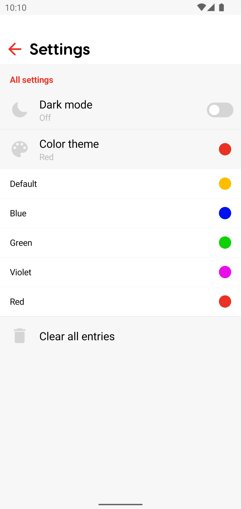
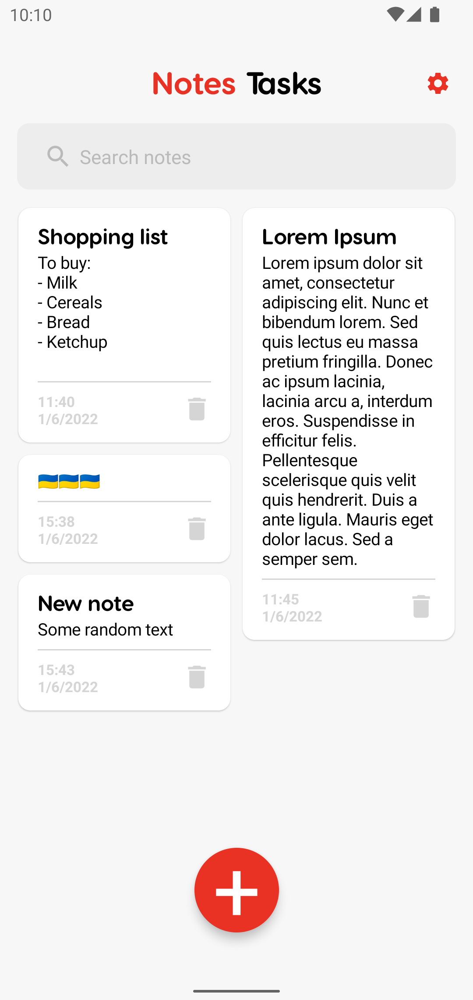

# RememberIT
A simple but reliable app with minimalistic and clean design for managing notes and tasks.
## Features
- Saving and manageing text notes
- Creating and managing tasks
- Marking tasks as done
- Receiving notification when the task is due
- Dark mode
- Changeing the color theme

## Overview
### Notes/Tasks screen

     

### Adding note/task

     

### Settings

### Dark mode

### Color theme change

     

## Technologies used to make an app
- [Kotlin](https://kotlinlang.org/)
- [Jetpack Compose](https://developer.android.com/jetpack/compose)
- [Compose Navigation](https://developer.android.com/jetpack/compose/navigation)
- [Accompanist libraries](https://google.github.io/accompanist/) for the UI
- MVVM Architecture
- [Dagger-hilt](https://dagger.dev/hilt/) for dependency injection
- [Room](https://developer.android.com/training/data-storage/room) database for storing notes and tasks
- [Data store](https://developer.android.com/topic/libraries/architecture/datastore) for saving preferences
